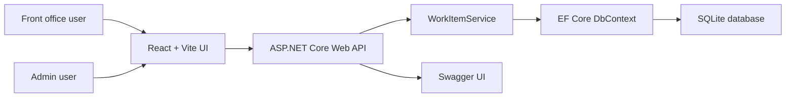
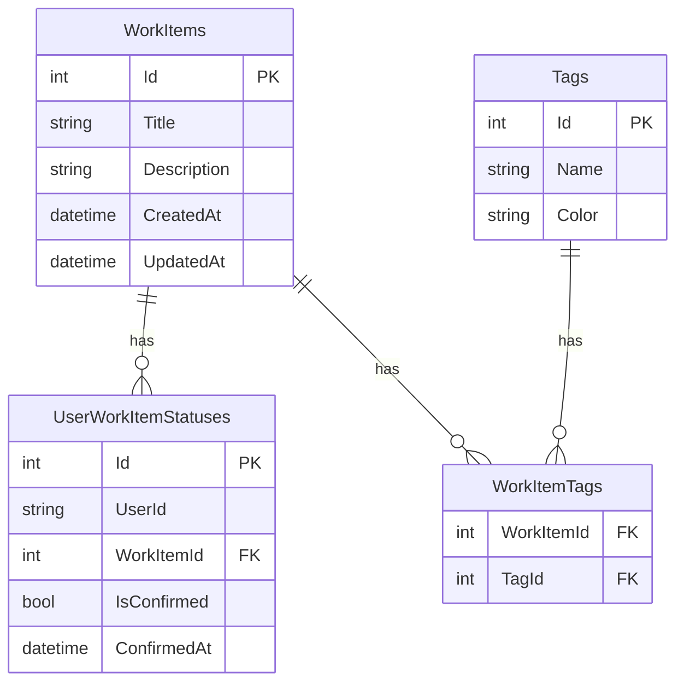

# My Work Item

這是一個 B2E「My Work Item」面試題的全端實作。

專案包含可執行的 Web UI、.NET API、SQLite 資料庫持久化，以及 Swagger API 文件。設計目標是讓面試 demo 可以直接從瀏覽器操作，而不是只透過 Swagger 驗證 API。

## 技術棧

- Backend: ASP.NET Core Web API, C#, .NET 8
- Database: SQLite, Entity Framework Core
- Frontend: React, TypeScript, Vite
- API 文件: Swagger / Swashbuckle

## 本機執行

### Backend

```powershell
cd backend
dotnet run --launch-profile http
```

Backend URLs:

- API: `http://localhost:5091`
- Swagger: `http://localhost:5091/swagger`

Backend 啟動時會自動套用 EF Core migrations。如果資料庫是空的，也會建立 demo 用的 Work Items 與 Tags。

### Frontend

```powershell
cd frontend
npm install
npm.cmd run dev
```

Frontend URL:

- App: `http://localhost:5173/work-items`

如果在 Windows PowerShell 中一般 `npm` 被 execution policy 擋住，可以改用 `npm.cmd`。

## Demo 路徑

Front office:

- `/work-items`
- `/work-items/{id}`

Admin:

- `/admin/work-items`
- `/admin/work-items/new`
- `/admin/work-items/{id}/edit`

## Demo 流程

### Front Office

1. 開啟 `http://localhost:5173/work-items`。
2. 在 sample users `alice` 和 `bob` 之間切換。
3. 使用 sort dropdown 切換排序方向。
4. 使用 pagination 切換頁面。
5. 選取一筆或多筆 Work Items。
6. 點擊 `Confirm selected`。
7. 開啟 `View` 進入 Work Item detail page。
8. 從 detail 回到 list 時，user、sort、page 會透過 query string 保留。
9. 對已確認的項目點擊 reopen action，可以把狀態改回 pending。

### Admin

1. 開啟 `http://localhost:5173/admin/work-items`。
2. 點擊 `New work item`。
3. 建立一筆包含 title 與 optional description 的 Work Item。
4. 點擊既有 Work Item 的 `Edit`。
5. 儲存修改。
6. 透過 confirmation dialog 刪除 Work Item。

## 專案核心目標

這個專案不是單純的 todo list，而是簡化版的 internal work item / issue tracker。

核心需求：

- Front office 使用者可以查看 WorkItem 清單與 detail。
- 每個使用者對同一個 WorkItem 有自己的確認狀態。
- 使用者可以批次 confirm selected items。
- 使用者可以將已確認的 item reopen / unconfirm。
- Admin 可以 create、update、delete WorkItems。
- WorkItem 可以透過 Tag / Label 分類。
- UI 採用接近 JIRA / issue tracker 的資訊架構，方便面試時 demo。

後續擴充方向：

- 真正的 authentication / authorization。
- Role-based visibility。
- 更完整的 workflow status，例如 Todo、In Progress、Done、Blocked。
- Tag CRUD。
- Priority、assignee、due date、drag sorting。
- Automated tests。
- 前端 component / page 拆分。

## 需求完成狀態

需求來源：PDF exercise "AI Coding - B2E: My Work Item"。

| Area | Requirement | Current Status |
| --- | --- | --- |
| 可執行 App | 需要可執行 Web UI，不能只有 Swagger | Completed |
| Backend | .NET / C# backend | Completed |
| Frontend | React / Vue / Blazor / Razor UI | Completed with React + Vite |
| Database | 基本資料持久化 | Completed with SQLite + EF Core |
| Work Item list | 顯示 id、title、status | Completed |
| Empty state | 沒有資料時顯示提示 | Completed |
| Default sorting | 預設 newest first | Completed |
| Sort switching | 使用者可切換 ascending / descending | Completed |
| Multi-select | row checkbox 與 select all | Completed |
| Selected row feedback | 選取 row 有視覺提示 | Completed |
| Confirm action | 只 confirm 目前使用者選取的 items | Completed |
| Unconfirm action | 透過 confirm dialog 改回 pending | Completed |
| User feedback | 成功與錯誤訊息 | Completed |
| Per-user state | 不同 user 的確認狀態分開保存 | Completed |
| Persist user state | 重新整理後狀態仍保留 | Completed |
| Detail page | `/work-items/{id}` 顯示完整欄位 | Completed |
| Return to list | 從 detail 回 list 時保留列表狀態 | Completed |
| Pagination state | 回 list 時保留 page state | Completed |
| Admin create | Admin 可以建立 Work Items | Completed |
| Admin update | Admin 可以編輯 Work Items | Completed |
| Admin delete | Admin 可以刪除 Work Items | Completed |
| Admin routes | `/admin/work-items/new`, `/admin/work-items/{id}/edit` | Completed |
| API spec | Swagger / API inspection | Completed |
| README | 啟動方式與開發說明 | Completed |
| Architecture diagram | C4 或等價架構圖 | Completed below |
| DB schema / ERD | Table schema 或 ERD | Completed below |
| Automated tests | Unit / integration tests | Not implemented yet |

## 開發階段

### Phase 1 - JIRA-like UI refresh

狀態：completed and build-verified。

- 加入 issue-tracker 風格 sidebar。
- 加入 dashboard-style page headers。
- 將 front-office list 改成 issue table。
- 加入 total、pending、confirmed summary cards。
- 加入更清楚的 status badges、tag chips 與 action buttons。
- 將 admin screen 調整成 dashboard management view。

### Phase 2 - Work Item labels / tags

狀態：completed and runtime-verified。

已實作：

- 新增 backend `Tag` 與 `WorkItemTag` models。
- 新增 `WorkItem` 與 `Tag` 的 many-to-many relationship。
- 新增 `TagDto`。
- 在 Work Item list/detail DTOs 加入 `Tags`。
- 在 create/update requests 加入 `TagIds`。
- 新增 `GET /api/admin/tags`。
- Seed demo labels，例如 `onboarding`、`setup`、`security`、`reporting`。
- 更新 frontend API types。
- 更新 front/admin UI，支援 tag chips 顯示與 admin form tag 選取。

Runtime verification：

- 確認 tag migration 會建立 `Tags` 與 `WorkItemTags`。
- 確認 `GET /api/admin/tags` 會回傳 seeded tags。
- 確認 `GET /api/work-items` 和 detail response 都包含 tags。
- 確認 front-office issue table 可以顯示 tag chips。
- 確認 admin form 可以顯示 tag selection controls。
- 確認 create/update/delete API flow 可以保存與替換 tag selections。

## 架構設計



目前採用簡單的 monolith / MVC-style 架構，而不是 microservice。

原因：

- 需求範圍小，domain boundary 清楚。
- Demo 需要能快速啟動、快速 trace flow。
- Controller、Service、DbContext、DTO 的分層已足夠表達工程設計。
- Microservice 會引入 deployment、network failure、distributed transaction 等額外複雜度，但對這個 exercise 沒有直接價值。

分層方式：

- Controller: 負責 HTTP route、query/body validation、response status。
- Service: 負責 business logic，例如 confirm、unconfirm、admin CRUD、tag sync。
- DbContext: 負責 EF Core schema、relationship、index。
- DTO: 作為 API contract，避免直接 expose EF entity。
- Migration: 保留 database schema 演進紀錄。

## 資料模型



### WorkItem / UserWorkItemStatus

`WorkItem` 是任務本身，包含 title、description、created time、updated time。

`UserWorkItemStatus` 是某個 user 對某個 WorkItem 的個人確認狀態。這個表有 `UserId + WorkItemId` unique index，確保同一個 user 對同一個 WorkItem 只會有一筆狀態。

Status 沒有直接放在 `WorkItem`，是因為同一個 WorkItem 對不同 user 可能有不同狀態。例如 Alice 已確認，但 Bob 還沒確認。如果把 `IsConfirmed` 放在 `WorkItem` 上，就會變成全域狀態，無法表達 per-user progress。

### Tag / WorkItemTag

Tag 使用 many-to-many relationship。

原因是：

- 一個 WorkItem 可以有多個 tags，例如 `onboarding` 和 `security`。
- 一個 tag 也可以套用到多個 WorkItems。
- 透過 join table `WorkItemTag` 可以保留未來擴充性。

目前 `Tag` 也包含 `Color`，讓後端資料可以支援前端 badge / chip 顯示，不需要完全由前端 hard-code label style。

### Role Visibility

目前專案尚未實作完整 role visibility。現階段只有 front/admin route 的 UI 區分，以及 fake users `alice`、`bob` 用來展示 per-user status。

如果需求擴充，我會傾向加入：

```text
Role
UserRole
WorkItemRoleVisibility
```

或簡化成：

```text
WorkItemVisibleRole {
  WorkItemId
  RoleName
}
```

這樣可以讓 WorkItem 保持任務定義本身，visibility 則作為另一個獨立關聯，不把權限規則塞進 WorkItem 主表。

## API Summary

Front office:

- `GET /api/work-items?userId=alice&sort=desc`
- `GET /api/work-items/{id}?userId=alice`
- `POST /api/work-items/confirm?userId=alice`
- `POST /api/work-items/{id}/unconfirm?userId=alice`

Admin:

- `GET /api/admin/work-items`
- `GET /api/admin/tags`
- `POST /api/admin/work-items`
- `PUT /api/admin/work-items/{id}`
- `DELETE /api/admin/work-items/{id}`

典型 confirm flow：

```text
User selects rows in React
  -> frontend sends workItemIds + userId
  -> Controller validates userId and non-empty IDs
  -> Service filters existing WorkItems
  -> Service upserts UserWorkItemStatus
  -> SaveChanges
  -> frontend reloads list
```

這裡的重點是 confirm 不會修改 `WorkItem`，而是更新 user-specific 的 `UserWorkItemStatus`。

## UI / UX 設計

UI 的方向是簡化版 JIRA / issue tracker。

設計重點：

- Sidebar 區分 Front work 與 Admin。
- Dashboard header 顯示目前 context。
- Summary cards 顯示 total、pending、confirmed。
- Issue table 呈現 WorkItems。
- WorkItem key 使用 `MWI-{id}`，讓項目更像 issue tracker。
- Status 使用 badge，讓 pending / confirmed 更容易掃描。
- Tag 使用 chip，讓分類資訊可以快速辨識。
- Detail page 保留 query string，回 list 時能維持 user、sort、page。
- Admin form 支援 create / edit / delete 以及 tag selection。

目前專案實際 styling 使用 plain CSS。若專案繼續擴大，可以再導入 Tailwind 或 component library，但 MVP 階段先用 CSS 控制 scope，避免把重點放到 design system 建置。

## 技術取捨

### 為什麼先不做完整 auth

完整 auth 會牽涉 login、token、claims、role mapping、refresh token、middleware 等議題。這些很重要，但不是這個 exercise 的核心。

目前使用 `alice` / `bob` fake users，是為了快速展示 per-user confirmation state。未來接上 auth 後，`userId` 可以從 authenticated claims 取得，而不是由 query string 傳入。

### 為什麼使用 SQLite

SQLite 適合這個面試 demo：

- 不需要額外安裝 database server。
- 專案 clone 後容易啟動。
- 搭配 EF Core migration 可以展示 schema 管理。
- 足以支撐目前 CRUD 與關聯查詢。

### 為什麼不做 microservice

目前 domain 還小，使用 ASP.NET Core Web API + EF Core 的 monolith 架構比較直接。這樣可以把開發時間集中在資料模型、API flow、UI flow 與 tradeoff 說明上。

### 目前故意先不做的功能

- 完整 authentication / authorization。
- Role-based visibility。
- Tag CRUD。
- Drag sorting。
- Priority / assignee / due date。
- Notification。
- Automated tests。
- 大型前端狀態管理 library。

這些都是合理的後續功能，但不是 MVP 必要條件。

## 驗證方式

開發過程中使用過的 manual validation：

- `dotnet build`
- `npm.cmd run build`
- Browser smoke test for front list, admin list, create, edit, delete, and detail navigation
- API smoke checks through `Invoke-RestMethod`
- Runtime verification for Phase 2 tag migration, tag API, tag chips, and tag persistence

目前狀態：

- Phase 1 UI changes 已 build-verified。
- Phase 2 Tag / Label changes 已 build-verified and runtime-verified。

建議後續補上的測試：

- Service unit tests for per-user confirmation behavior。
- API integration tests for admin CRUD。
- Frontend component tests for list state and detail navigation。

## AI 協作開發方式

AI 在這個專案中是 pair programming collaborator，不是完全自動產生專案的工具。

我的使用方式：

1. 先自己拆需求與資料模型。
2. 使用 GPT / Claude 討論架構與 API flow。
3. 使用 Codex 掃描專案，先分析，不直接修改。
4. 讓 AI 提出方案、缺漏與風險。
5. 再讓 AI 協助產生 CRUD、DTO、API client、UI skeleton。
6. 自己 review business logic，例如 per-user status 是否正確、tag sync 是否合理。
7. 透過 build、API smoke test、browser flow 驗證 AI 產出的內容。
8. 控制 scope，避免 AI 加入過度設計，例如完整 auth、microservice、notification system。
9. 後續使用 AI 協助 debug、refactor、補 README 與整理 edge cases。

AI 適合加速 boilerplate、檢查缺漏、整理文件與輔助 debug。但核心 domain model、scope boundary、business rule 與 tradeoff 仍然由我主導。

## Pair Programming Demo 說明重點

建議 demo 時可以照這個順序說明：

1. 先說明資料模型：`WorkItem` 是任務定義，`UserWorkItemStatus` 是每個 user 自己的確認狀態。
2. 展示切換 `alice` / `bob`，說明同一個 WorkItem 對不同 user 可以有不同 status。
3. 展示 confirm selected，說明 API 更新的是 `UserWorkItemStatus`，不是 `WorkItem`。
4. 展示 Admin CRUD，說明 admin 管理任務定義，front user 管理自己的確認進度。
5. 展示 Tags，說明 `WorkItem` 和 `Tag` 使用 many-to-many。
6. 說明為什麼先不做完整 auth，而是用 fake users 聚焦 core flow。
7. 說明為什麼使用 monolith / MVC，而不是 microservice。
8. 說明 AI 協作方式：AI 加速實作，我負責需求拆解、資料模型、review 與 scope control。

一句話總結：

> 這個專案我把它當成縮小版的 internal issue tracker。設計重點不是堆功能，而是把 WorkItem definition、user-specific confirmation state、admin management、tag classification 這幾個責任拆清楚，並用簡單可執行的架構完成 MVP。

## Remaining Work

- Add automated tests。
- 將大型 `App.tsx` 拆成 route / page / component。
- 若面試 scope 擴大，加入 authentication 與 role-based visibility。
