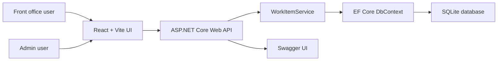
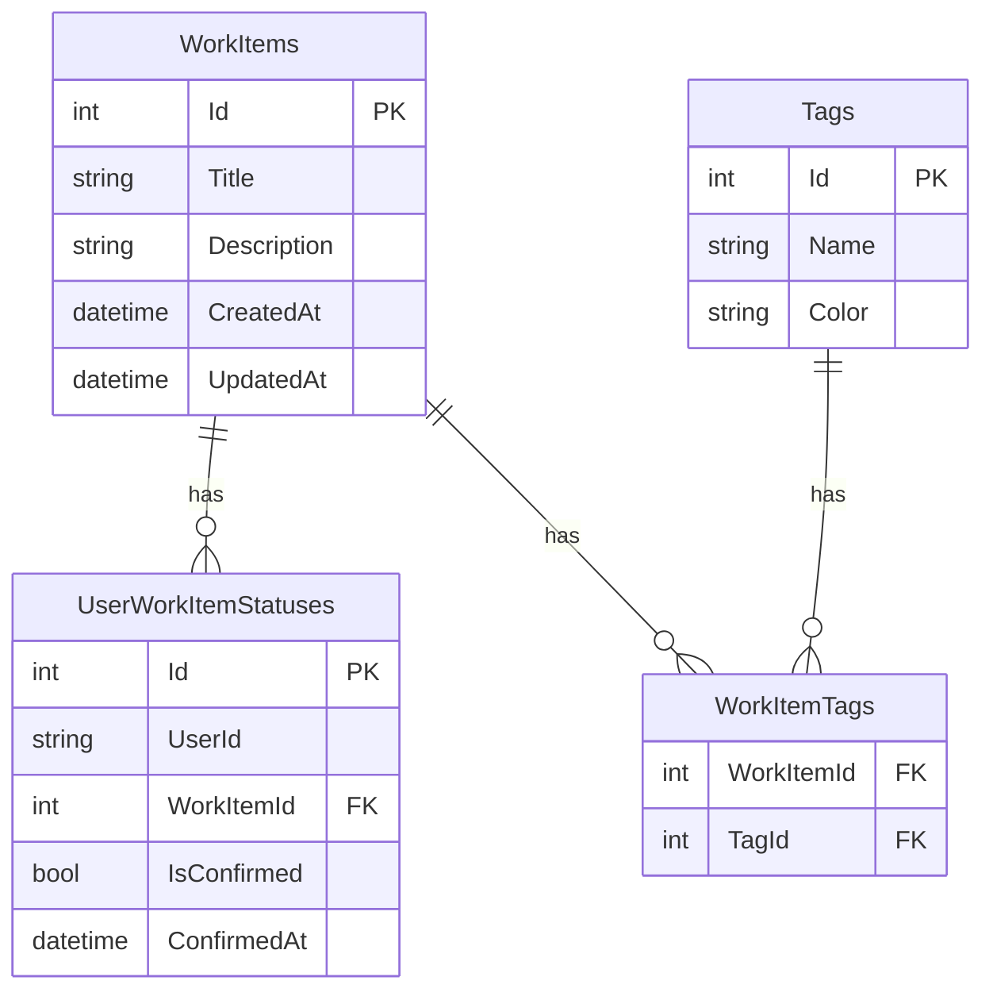

# My Work Item

Full-stack implementation for the B2E "My Work Item" interview exercise.

The project provides a runnable Web UI, .NET API, SQLite persistence, and Swagger API documentation. It is designed so the interview demo can be shown from the browser instead of only through Swagger.

## Tech Stack

- Backend: ASP.NET Core Web API, C#, .NET 8
- Database: SQLite, Entity Framework Core
- Frontend: React, TypeScript, Vite
- API docs: Swagger / Swashbuckle

## Run Locally

### Backend

```powershell
cd backend
dotnet run --launch-profile http
```

Backend URLs:

- API: `http://localhost:5091`
- Swagger: `http://localhost:5091/swagger`

The backend applies EF Core migrations on startup and seeds sample Work Items when the database is empty.

### Frontend

```powershell
cd frontend
npm install
npm.cmd run dev
```

Frontend URL:

- App: `http://localhost:5173/work-items`

On Windows PowerShell, use `npm.cmd` if normal `npm` is blocked by execution policy.

## Demo Paths

Front office:

- `/work-items`
- `/work-items/{id}`

Admin:

- `/admin/work-items`
- `/admin/work-items/new`
- `/admin/work-items/{id}/edit`

## Demo Flow

### Front Office

1. Open `http://localhost:5173/work-items`.
2. Switch between sample users `alice` and `bob`.
3. Change sort direction with the sort dropdown.
4. Move between pages with pagination controls.
5. Select one or more Work Items.
6. Click `Confirm selected`.
7. Open `View detail` to inspect the Work Item detail page.
8. Return to the list; user, sort, and page state are preserved through query string parameters.
9. Click the unconfirm action on confirmed items to mark them back to pending.

### Admin

1. Open `http://localhost:5173/admin/work-items`.
2. Click `New Work Item`.
3. Create a Work Item with title and optional description.
4. Click `Edit` on an existing Work Item.
5. Save changes.
6. Delete an existing Work Item after confirmation.

## Requirement Progress

Source requirement: PDF exercise "AI Coding - B2E: My Work Item".

| Area | Requirement | Current Status |
| --- | --- | --- |
| Runnable app | Must have a runnable Web UI, not only Swagger | Completed |
| Backend | .NET / C# backend | Completed |
| Frontend | React / Vue / Blazor / Razor UI | Completed with React + Vite |
| Database | Basic persistence | Completed with SQLite + EF Core |
| Work Item list | Show id, title, status | Completed |
| Empty state | Show message when no data exists | Completed |
| Default sorting | Newest first by default | Completed |
| Sort switching | User can switch ascending / descending | Completed |
| Multi-select | Row checkbox and select all | Completed |
| Selected row feedback | Selected row has visual highlight | Completed |
| Confirm action | Confirm selected items for current user only | Completed |
| Unconfirm action | Confirm dialog, then mark back to pending | Completed |
| User feedback | Success and error messages | Completed |
| Per-user state | Confirmation state is separated by user | Completed |
| Persist user state | State remains after reload | Completed |
| Detail page | `/work-items/{id}` with full item fields | Completed |
| Return to list | Return from detail while preserving list state | Completed |
| Pagination state | Preserve page state when returning from detail | Completed |
| Admin create | Admin can create Work Items | Completed |
| Admin update | Admin can edit Work Items | Completed |
| Admin delete | Admin can delete Work Items | Completed |
| Admin routes | `/admin/work-items/new`, `/admin/work-items/{id}/edit` | Completed |
| API spec | Swagger / API inspection | Completed |
| README | Startup and progress documentation | Completed |
| Architecture diagram | C4 or equivalent architecture diagram | Completed below |
| DB schema / ERD | Table schema or ERD | Completed below |
| Automated tests | Unit/integration tests | Not implemented yet |

## Current Implementation Phases

### Phase 1 - JIRA-like UI refresh

Status: completed and build-verified.

- Added an issue-tracker style sidebar.
- Added dashboard-style page headers.
- Reworked the front-office list into an issue table.
- Added summary cards for total, pending, and confirmed Work Items.
- Added clearer status badges, tag-chip styling, and action buttons.
- Reworked the admin screen into a dashboard management view.

### Phase 2 - Work Item labels / tags

Status: completed and runtime-verified.

Implemented:

- Added backend `Tag` and `WorkItemTag` models.
- Added a many-to-many relationship between `WorkItem` and `Tag`.
- Added `TagDto`.
- Added `Tags` to Work Item list/detail DTOs.
- Added `TagIds` to create/update requests.
- Added `GET /api/admin/tags`.
- Added seeded demo labels such as `onboarding`, `setup`, `security`, and `reporting`.
- Updated the frontend API types for tags.
- Updated the front/admin UI to render real tag chips and support tag selection in the admin form.

Runtime verification completed:

- Confirmed the tag migration creates `Tags` and `WorkItemTags`.
- Confirmed `GET /api/admin/tags` returns seeded tags.
- Confirmed `GET /api/work-items` and detail responses include tags.
- Confirmed the front-office issue table renders tag chips.
- Confirmed the admin form renders tag selection controls.
- Confirmed create/update/delete API flow persists and replaces tag selections.

## Architecture Diagram



## Data Model



`UserWorkItemStatuses` has a unique index on `UserId + WorkItemId`, so each user's confirmation state is stored independently.

## API Summary

Front office:

- `GET /api/work-items?userId=alice&sort=desc`
- `GET /api/work-items/{id}?userId=alice`
- `POST /api/work-items/confirm?userId=alice`
- `POST /api/work-items/{id}/unconfirm?userId=alice`

Admin:

- `GET /api/admin/work-items`
- `GET /api/admin/tags`
- `POST /api/admin/work-items`
- `PUT /api/admin/work-items/{id}`
- `DELETE /api/admin/work-items/{id}`

## Validation Approach

Manual validation performed during development:

- `dotnet build`
- `npm.cmd run build`
- Browser smoke test for front list, admin list, create, edit, delete, and detail navigation
- API smoke checks through `Invoke-RestMethod`
- Runtime verification for Phase 2 tag migration, tag API, tag chips, and tag persistence

Current validation note:

- Phase 1 UI changes have been build-verified.
- Phase 2 Tag/Label changes have been build-verified and runtime-verified.

Recommended next test additions:

- Service unit tests for per-user confirmation behavior
- API integration tests for admin CRUD
- Frontend component tests for list state and detail navigation

## AI Tool Usage Notes

AI assistance was used to:

- Translate PDF requirements into user-story checkpoints
- Generate the initial API/UI implementation shape
- Identify implementation gaps against the PDF
- Draft README progress documentation
- Run build and browser verification loops

AI output was reviewed and adjusted by:

- Running frontend and backend builds
- Testing browser flows against the running local app
- Removing template API code not related to the exercise
- Aligning the backend target framework to the installed company laptop SDK: .NET SDK `8.0.420`

## Remaining Work

- Add automated tests
- Improve frontend structure by splitting large `App.tsx` into route/page components
- Add authentication or role handling if the interview scope expands beyond sample users
